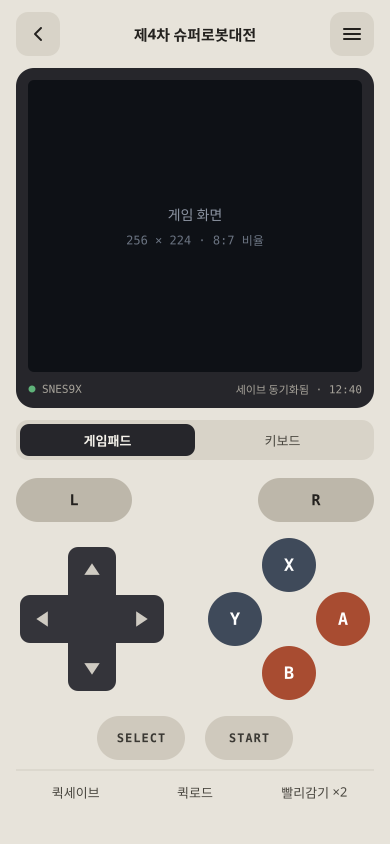
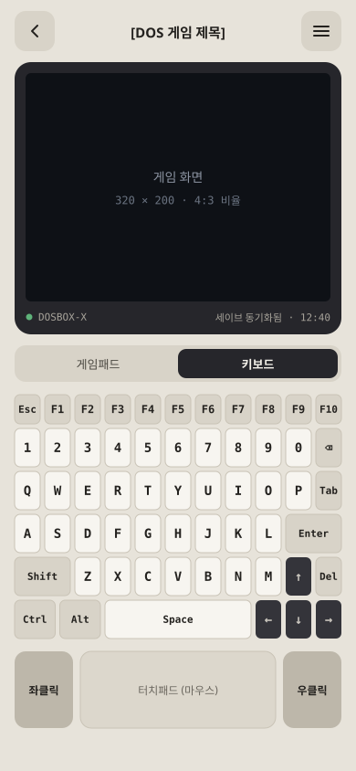
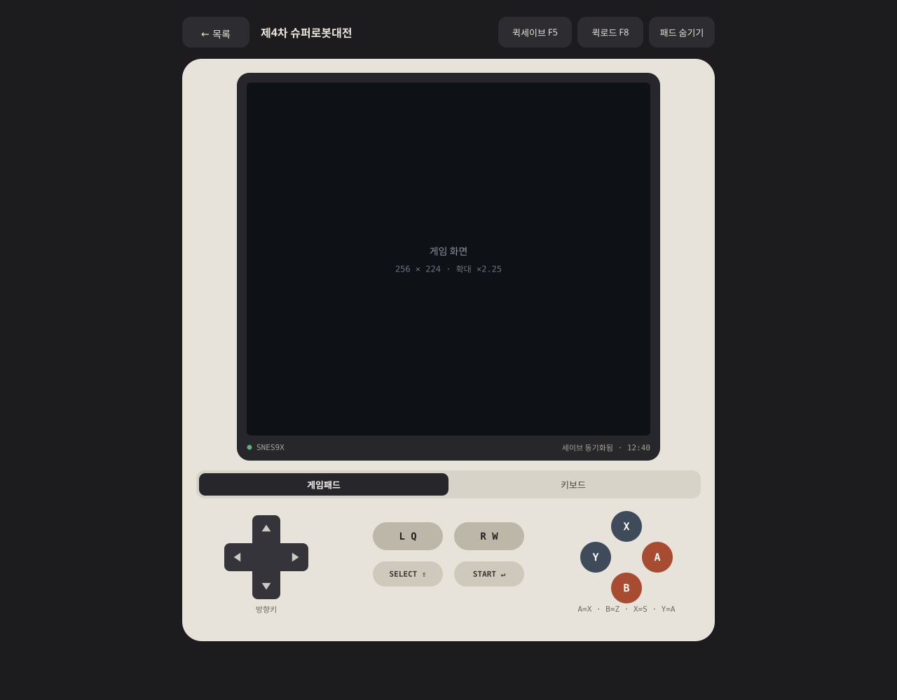
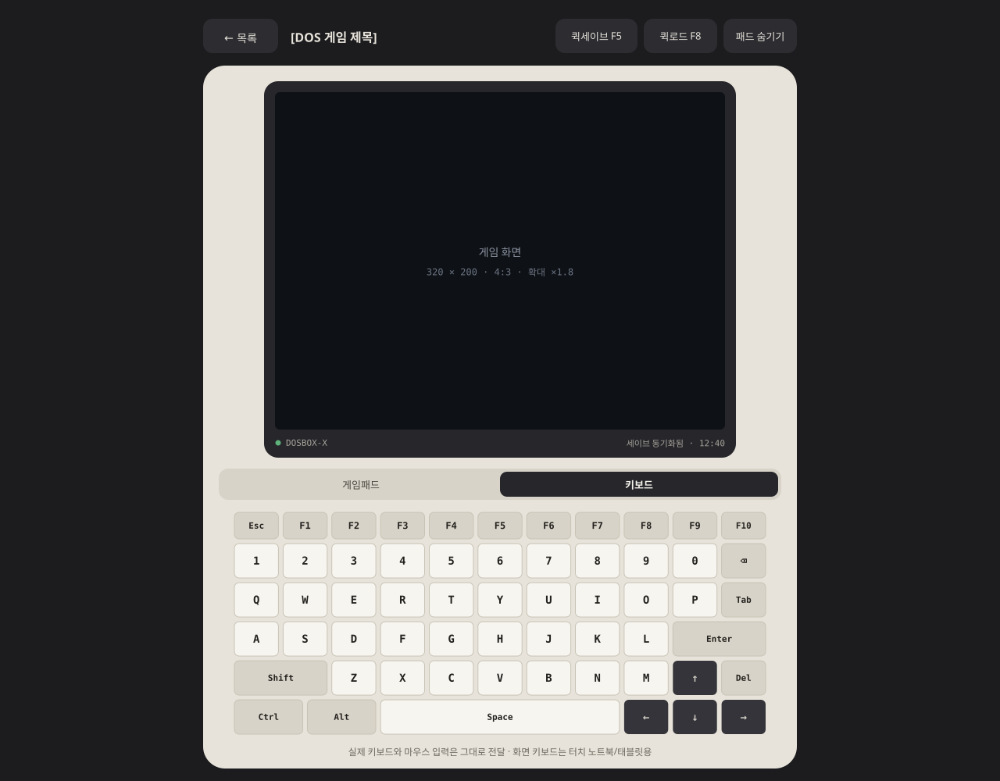

# 웹 고전게임 에뮬레이터 — 작업개요서

> 회의(클라우드 세션) 결과 정리본. 실제 개발은 로컬/서버 Claude Code에서 진행한다.
> 목업 이미지는 같은 브랜치의 `mockups/` 폴더에 있다 (`ccr-c4bec42a-kdahz7`).
> 이 문서에서 **[미확인]** 표시가 붙은 항목은 회의 중 검증하지 못한 것이다. 구현 전에 공식 문서나 실제 동작으로 먼저 확인할 것.

---

## 1. 목표와 범위

- **개인 전용** 웹 에뮬레이터. 기존 로그인 세션 뒤에 두고 본인만 사용한다.
- **모바일과 데스크탑 모두** 같은 페이지에서 플레이할 수 있어야 한다.
- 대상은 **턴제 게임 위주**다. 액션 게임은 모바일 터치 조작이 어려워서 제외하고, 슈퍼 마리오만 시험용으로 예외를 둔다.
- 게임은 **전부 한글판**이어야 한다. 게임기 게임은 사실상 팬 한글패치판이다.
- 범위 밖: 공개 서비스, 다인용 기능, 넷플레이.

## 2. 핵심 구조

에뮬레이션은 전부 **클라이언트(브라우저, WASM)**에서 돌아간다. 서버는 정적 파일 서빙, 인증 확인, 세이브 저장만 담당한다. 그래서 저전력 서버로도 부하 문제가 없다.

```
브라우저 (EmulatorJS / js-dos, WASM)
  │  ① 페이지·코어(.js/.wasm) 로드       ← nginx 정적 서빙 (캐시)
  │  ② ROM/게임 번들 요청                ← PHP 세션 확인 → X-Accel-Redirect → nginx internal
  │  ③ 세이브 업로드/다운로드            ← PHP (세션 확인) → 디스크 + MariaDB 메타데이터
  ▼
서버: nginx 1.24 + PHP 8.3-fpm + MariaDB 10.11
```

## 3. 서버 환경 (현행)

| 항목 | 내용 |
|---|---|
| 하드웨어 | Intel NUC7CJYH, Celeron J4005 (2코어), RAM 16GB, WD Green SSD 480GB (여유 약 419GB) |
| OS | Ubuntu 24.04.4 LTS, 커널 6.8 |
| 웹 | nginx 1.24.0 (80/443), PHP 8.3.6 + php8.3-fpm (OPcache 켜짐) |
| PHP 확장 | mysqli, pdo_mysql, curl, gd, mbstring, openssl, sodium, zip 등. intl, bcmath, imagick, redis, apcu는 없음 |
| DB | MariaDB 10.11.14, `127.0.0.1:5311` (로컬 전용) |
| 가상호스트 | kwonmo.com → `/var/www/html/hm`, api.kwonmo.com → `/var/www/html/api`, kwonmo.co.kr → `/var/www/html/pt`, kwonmo.net → 리다이렉트/프록시 |
| 인증서 | Let's Encrypt (kwonmo.com), certbot.timer 자동 갱신 |
| Python | 3.12 시스템 기본만 있음. 이 프로젝트에는 쓰지 않는다 |

- 새 런타임(Node, Python 패키지 등)은 **추가하지 않는다.** nginx, PHP, MariaDB로 전부 구현한다.
- 새로 설치할 게 생기면 먼저 사용자에게 알린다.

## 4. 에뮬레이터 구성 (확정)

| 구분 | 프론트엔드 | 코어/엔진 | 비고 |
|---|---|---|---|
| 게임기 (SFC) | **EmulatorJS** | **snes9x** | 현재 게임 리스트는 전부 SFC |
| DOS | **js-dos** | **DOSBox-X** | 사용자가 마지막으로 쓴 엔진이 DOSBox-X |
| (보류) 패미컴 | EmulatorJS | fceumm | 패미컴 원판 게임이 추가될 때만 |

- 모든 파일(프론트엔드, 코어)은 **내 서버에서 self-host**한다. 외부 CDN을 쓰지 않는다.
- 라이선스: snes9x는 비상업 조건, js-dos는 GPL이다. 개인용이라 문제없다. EmulatorJS 라이선스는 [미확인].
- [미확인] js-dos 최신 버전이 외부 클라우드 서비스 없이 완전히 self-host로 동작하는지, 세이브를 로컬이나 내 서버로만 저장하도록 설정할 수 있는지 확인할 것.
- [미확인] EmulatorJS가 DOS용 libretro 코어(DOSBox Pure 등)를 지원하는지. 지원하면 프론트엔드를 하나로 합치는 걸 검토하고, 아니면 js-dos를 별도로 쓴다.

## 5. 게임 리스트

| 게임 | 기종 | 코어 | 한글 | 비고 |
|---|---|---|---|---|
| 제4차 슈퍼로봇대전 | SFC (1995) | snes9x | 한글패치 리뉴얼판 v1.01 (원 제작자가 27년 만에 전면 재작업, 네이버 카페 "한식구"에서 배포) | 패치가 요구하는 원본 ROM 판본 [미확인] |
| 프론트 미션 | SFC (1995) | snes9x | 유저 한글패치 있음. **불완전** | 전투 중 적군(U.S.N) 병사 대사가 깨져서 나옴. 최신판에서 고쳐졌는지 [미확인] |
| 슈퍼 마리오 컬렉션 (All-Stars, 마리오3 포함) | SFC (1993) | snes9x | 필요 없음 | 시험용 예외. 대사가 거의 없음 |
| DOS 게임들 | DOS | DOSBox-X | — | **리스트 미정.** 게임마다 CD판/디스켓판과 한글 환경 필요 여부 확인 |

### 한글패치 처리 원칙
- 패치(IPS/BPS/xdelta)는 **서버에 올리기 전에 오프라인에서 미리 적용**한다. 에뮬레이터 쪽에서는 패치를 다루지 않는다.
- 패치마다 대상 원본 판본(CRC)이 정해져 있다. 판본이 다르면 패치가 깨진다.
- ROM 용량을 늘리거나 구조를 바꾸는 패치가 있으므로, 적용한 뒤 snes9x에서 실제로 구동되는지 확인한다.
- 특수칩: 위 SFC 게임들은 특수칩이 없는 것으로 알고 있다 [미확인, ROM 헤더로 확인]. BIOS가 필요한 기종은 아직 없다.
- DOS: 외국 게임 한글패치판 중 일부는 한글 환경 상주 프로그램을 먼저 띄워야 한다. 해당되는 게임은 js-dos 번들 안에 넣고 자동 실행하게 설정한다.

### 저작권
- ROM과 게임 파일은 사용자가 직접 준비한다. 공개 경로로는 절대 노출하지 않는다 (6장 참고).

## 6. 파일 배치와 인증

### 디렉터리 (웹 root 밖)
```
/srv/emu/
├── roms/      # SFC ROM (한글패치 적용 완료본)
├── dos/       # js-dos 번들 (.jsdos)
└── saves/     # 세이브 (7장)
```

**웹 root 밖에 두는 이유:**
1. 웹 root 안의 파일은 nginx가 PHP(세션 검사)를 거치지 않고 바로 내려준다. 그러면 로그인이 우회된다.
2. 세이브 업로드 디렉터리가 웹 root 안에 있으면 `.php` 파일이 업로드됐을 때 실행될 수 있다.
3. `deny` 설정으로 막는 방식은 location 우선순위를 잘못 쓰면 노출된다. root 밖에 두면 설정을 실수해도 안전하다.
4. 배포(rsync --delete 등)할 때 데이터가 지워지지 않고, 백업과 권한 관리도 따로 할 수 있다.

### 인증 흐름 (X-Accel-Redirect)
```
GET /emu/rom.php?id=srw4
 → PHP: 세션 확인. 실패하면 403
 → 성공하면 헤더 `X-Accel-Redirect: /_emu_roms/<파일명>`만 보내고 종료
 → nginx: internal location에서 sendfile로 전송 (Range 요청 지원, FPM 워커를 붙잡지 않음)
```
- 파일명은 **DB나 화이트리스트에서 id로 찾아서** 결정한다. 요청 파라미터를 경로에 그대로 붙이지 않는다 (경로 조작 방지).

### 설치 위치 [결정 필요]
- 추천: **이미 로그인이 구현된 사이트 밑에 `/emu/` 경로로** 넣는다. 세션 쿠키를 그대로 쓸 수 있고, 인증서도 바꿀 필요가 없다.
- 로그인이 hm, api, pt 중 어느 사이트에 있는지, 세션이 PHP 기본 `$_SESSION`인지 DB 기반 자체 구현인지는 **아직 확인하지 못했다.** 해당 코드를 먼저 읽고 결정한다.
- 서브도메인(예: game.kwonmo.com)으로 가면 인증서에 도메인 추가, 세션 쿠키 도메인 설정 변경이 필요하다.

### nginx 설정 초안 (검증 전 스케치)
```nginx
# 에뮬레이터 페이지: 멀티스레드 코어용 헤더
location /emu/ {
    add_header Cross-Origin-Opener-Policy  "same-origin" always;
    add_header Cross-Origin-Embedder-Policy "require-corp" always;
    # 기존 PHP 처리 설정과 합칠 것
}

# 코어/프론트엔드 정적 파일: 미리 압축해 둔 .gz 사용, 긴 캐시
location /emu/assets/ {
    gzip_static on;
    add_header Cache-Control "private, max-age=31536000, immutable" always;
}

# ROM / DOS 번들: 외부에서 직접 접근 불가, PHP가 X-Accel-Redirect로만 연다
location /_emu_roms/ { internal; alias /srv/emu/roms/; }
location /_emu_dos/  { internal; alias /srv/emu/dos/; }

# 세이브 업로드: 이 location에서만 업로드 한도를 올린다 (nginx 기본값은 1MB)
location = /emu/save.php {
    client_max_body_size 20m;
    # PHP 처리 설정
}
```
- `add_header`는 하위 location에서 다시 선언하면 상위 location의 헤더가 상속되지 않는다. 헤더가 실제로 나가는지 확인할 것.
- [미확인] `/etc/nginx/mime.types`에 `application/wasm wasm;`가 있는지 `grep wasm /etc/nginx/mime.types`로 확인한다. 없으면 추가한다. 이게 없으면 wasm 스트리밍 컴파일이 안 된다.
- `.wasm`과 `.js`는 배포할 때 `.gz`로 미리 압축해 둔다 (CPU가 약해서 요청마다 압축하지 않게). brotli는 쓰지 않는다 (새 모듈 설치가 필요함).
- PHP의 `upload_max_filesize`와 `post_max_size`도 nginx 한도에 맞춘다. 현재 값 [미확인].

## 7. 세이브 처리

### 세이브 종류와 원칙
| 종류 | 크기 | 원칙 |
|---|---|---|
| SRAM (`.srm`, 게임 안에서 저장한 것) | 수 KB~수십 KB | **진짜 세이브.** 반드시 서버에 백업한다. 코어 버전이 바뀌어도 호환된다 |
| 세이브 스테이트 | 수백 KB 수준 | 편의 기능이다. 코어 버전에 종속되므로, 코어를 업데이트하면 깨질 수 있다는 걸 전제로 둔다 |
| DOS 게임 저장 파일 | 게임마다 다름 | 진짜 세이브. 게임 디렉터리에서 바뀐 파일만 zip으로 묶어서 백업한다 |

- DOSBox-X 세이브 스테이트는 브라우저에서 안정적인지 [미확인]. DOS는 게임 자체 저장 파일에만 의존하는 것을 기본으로 한다.

### 저장 방식: 파일은 디스크, 메타데이터는 MariaDB
- JSON에 base64로 넣지 않는다 (용량 약 33% 증가). DB BLOB에도 넣지 않는다 (백업하고 파일을 꺼내 보기가 번거로움).
- 경로: `/srv/emu/saves/{game_id}/{kind}/{slot}/{timestamp}.{ext}`
- **덮어쓰지 않고 버전을 쌓는다.** 게임, 종류, 슬롯마다 최근 N개만 남긴다 (N은 구현할 때 결정).

### 테이블 초안
```sql
CREATE TABLE emu_saves (
  id           BIGINT UNSIGNED AUTO_INCREMENT PRIMARY KEY,
  game_id      VARCHAR(64)  NOT NULL,
  kind         ENUM('sram','state','dosfs') NOT NULL,
  slot         TINYINT UNSIGNED NOT NULL DEFAULT 0,
  core         VARCHAR(32)  NOT NULL,          -- snes9x / dosbox-x
  core_version VARCHAR(32)  NULL,              -- 스테이트 호환성 판단용
  path         VARCHAR(255) NOT NULL,
  size         INT UNSIGNED NOT NULL,
  sha256       CHAR(64)     NOT NULL,
  device       VARCHAR(32)  NULL,              -- pc / phone 등
  created_at   DATETIME     NOT NULL DEFAULT CURRENT_TIMESTAMP,
  INDEX idx_lookup (game_id, kind, slot, created_at)
);
```

### 동기화 규칙
- 평소에는 브라우저 **IndexedDB**에 저장한다. 서버는 백업이자 기기 간 동기화 용도다.
- **덮어쓰기 사고 방지:** 업로드할 때 "마지막으로 받은 버전 id"를 함께 보낸다. 서버에 그보다 새 버전이 있으면 409로 거절하고, 사용자가 어느 쪽을 쓸지 고르게 한다. 버전을 쌓아 두므로 잘못 골라도 복구할 수 있다.
- 업로드 시점: 게임 종료할 때 자동, 그리고 수동 "지금 백업" 버튼.
- [미확인] EmulatorJS의 세이브 이벤트 콜백 유무, SRAM과 스테이트를 꺼내고 넣는 API. [미확인] js-dos에서 변경된 파일을 꺼내는 API.
- 화면에 동기화 상태를 항상 표시한다 (목업: "세이브 동기화됨 · 12:40").

## 8. UI

### 공통 구조
- **위: 게임 화면 / 아래: 컨트롤러.** 휴대용 게임기처럼 생긴 구성이다.
- 상단바: 목록으로 가기, 게임 제목, 메뉴.
- 화면 아래 상태줄: 코어 이름, 세이브 동기화 상태.
- **컨트롤러 탭 `게임패드 | 키보드`**: 기종에 따라 기본 탭을 자동으로 고르고(SFC는 게임패드, DOS는 키보드), 사용자가 전환할 수 있다.
- 화면 비율: SFC는 8:7 (256×224), DOS는 4:3 (320×200을 4:3으로 표시). 확대는 정수배에 가깝게 하고, 픽셀이 뭉개지지 않게 한다.
- 모든 터치 대상은 최소 44px로 한다. 모바일 키보드의 개별 키만 예외다 (아래 참고).

### 게임패드 탭 (SFC)
- L/R, 방향키, ABXY (X 위, Y 왼쪽, A 오른쪽, B 아래), SELECT/START.
- 모바일 하단 빠른 버튼: **퀵세이브 / 퀵로드 / 빨리감기 ×2.** 빨리감기는 슈로대처럼 전투 연출이 긴 턴제 게임에서 필수다.
- 데스크탑 키 매핑 (초안): 방향키 = 방향키, A=X, B=Z, X=S, Y=A, L=Q, R=W, SELECT=Shift, START=Enter, 퀵세이브=F5, 퀵로드=F8. "패드 숨기기"로 화면만 볼 수 있게 한다.
- 멀티터치: 방향키를 누른 채로 A 버튼 누르기가 되어야 한다 (pointer 이벤트로 버튼별 독립 처리).

### 키보드 탭 (DOS)
- 간략 QWERTY. 모든 행을 11칸 폭에 맞췄다.
  - `Esc F1~F10`
  - `1~0 ⌫`
  - `Q~P Tab`
  - `A~L Enter`
  - `Shift Z~M ↑ Del`
  - `Ctrl Alt Space ← ↓ →`
- **모바일에 별도의 터치패드나 클릭 버튼은 두지 않는다.** 게임 화면을 직접 터치하면 마우스로 동작하게 한다 (탭하면 클릭). [미확인] js-dos의 터치를 마우스로 처리하는 방식과 옵션.
- 모바일에서 키 하나는 폭 약 29px이다 (폰 기본 키보드와 비슷). 실제로 써 보고 좁으면 F키 줄을 접을 수 있게 하는 걸 검토한다.
- 데스크탑에서는 실제 키보드와 마우스 입력을 그대로 게임에 전달하고, 화면 키보드는 터치 노트북이나 태블릿용이다.
- 게임별로 자주 쓰는 키만 모은 프리셋은 DOS 게임 리스트가 정해진 뒤에 결정한다.

### 기타
- 모바일 가로 모드: 화면을 가운데 두고 컨트롤을 양옆으로 나누는 구성 (이번 SVG에는 포함하지 않음. 필요하면 추가).
- 오디오는 사용자가 한 번 조작한 뒤에 시작된다 (브라우저 자동재생 정책). 게임 시작 버튼을 누르는 것으로 해결한다.

### 목업 (`mockups/`)

| 파일 | 내용 |
|---|---|
| `mockups/mobile-gamepad.svg` | 모바일 세로, 게임패드 탭 (390×844) |
| `mockups/mobile-keyboard.svg` | 모바일 세로, 키보드 탭 (390×844) |
| `mockups/desktop-gamepad.svg` | 데스크탑, 게임패드 탭 (1280×1000) |
| `mockups/desktop-keyboard.svg` | 데스크탑, 키보드 탭 (1280×1000) |






색 팔레트 (목업 기준):

| 용도 | 색 |
|---|---|
| 본체 | `#E7E3DA` |
| 보조 면 | `#D8D3C8` |
| 글자 | `#23211E` |
| 베젤 | `#26262B` |
| 화면 | `#0E1116` |
| 방향키, 방향 키캡 | `#34343A` |
| L/R | `#BDB7AA` |
| SELECT/START | `#CFC9BD` |
| A/B | `#A84C31` |
| X/Y | `#3F4A5A` |
| 일반 키캡 | `#F7F5F0` |
| 데스크탑 배경 | `#1C1C1F` |

## 9. 작업 순서 (제안)

1. **사전 확인:** 로그인 세션 위치와 구현 방식, `mime.types`의 wasm 항목, PHP 업로드 한도, js-dos self-host 가능 여부.
2. **뼈대:** `/srv/emu` 디렉터리와 권한, nginx location(internal, COOP/COEP, 캐시), `rom.php`(세션 확인 + X-Accel-Redirect).
3. **SFC 1개 구동:** EmulatorJS self-host + snes9x로 제4차 슈로대(한글패치 적용본)를 PC와 폰에서 실행.
4. **세이브:** IndexedDB 저장, 서버 백업과 버전 관리, 충돌 처리(409).
5. **UI:** 목업대로 컨트롤러와 탭, 빨리감기, 퀵세이브/퀵로드, 동기화 표시.
6. **DOS:** js-dos + DOSBox-X, 키보드 탭, 터치를 마우스로 쓰는 처리. DOS 게임 리스트가 정해진 뒤에.
7. **게임 목록 페이지:** 게임 카드, 마지막 플레이 시각, 세이브 상태.

## 10. [미확인] 항목 모음

- [ ] 로그인 세션이 있는 사이트(hm/api/pt)와 세션 구현 방식
- [ ] js-dos: 외부 서비스 없이 self-host 가능한지, 세이브 저장 위치 설정, 변경된 파일을 꺼내는 API, 터치를 마우스로 처리하는 방식
- [ ] EmulatorJS: 라이선스, 세이브 이벤트 콜백, SRAM/스테이트 입출력 API, DOS 코어 지원 여부
- [ ] nginx `mime.types`의 wasm 항목
- [ ] PHP `upload_max_filesize` / `post_max_size` 현재 값
- [ ] 제4차 슈로대 리뉴얼 패치(v1.01)의 대상 원본 ROM 판본
- [ ] 프론트 미션 한글패치의 최신판과 알려진 문제가 고쳐졌는지
- [ ] SFC 게임들의 특수칩 유무 (ROM 헤더로 확인)
- [ ] DOSBox-X 세이브 스테이트가 브라우저에서 안정적인지
- [ ] 집 인터넷 회선의 업로드 속도 (외부에서 접속할 때 대용량 DOS 번들을 처음 받는 시간에 영향)
